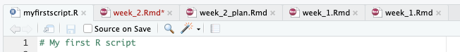

```{r setup, include=FALSE}
knitr::opts_chunk$set(echo = TRUE)
```

[&larr; Back to the SC1102 course page](../)

## Welcome back to R ##
Oh, I see you're still here! Great!

Clearly last week was so intellectually stimulating, you've come back for more. Well good news, this week we are tackling ``reproducibility!``. 

What is reproducibility I hear you ask? 

Great question! Reproducibility is the ability to reproduce a set of results given an input dataset and an accurate set of methods. In science, there aren't many concepts more important than reproducibility. If you conduct a bunch of analyses or experiments to obtain a set of results, but the next person to attempt what you did can't do so because either the initial input data is missing or corrupted, or the methodology by which you obtained your results is incomplete or inaccurate, you may as well have not done the analysis in the first place. If your scientific argument is based on an intellectual framework that looks something like this:

<div align="center">
  
</div>

then it might be time to step away from the science and head back to tiktok.

It's not just in science where reproducibility matters either.

<div align="center">
  
</div>

The need to publish your methods and workflows in a reproducible way is absolutely critical, but the problem is, it's often incredibly boring and tedious. Luckily for you, we're working in R where producing reproducible code is baked into the fabric of the whole language. Last week we learnt some basic commands in order take in some data, manipulate it and process it but the issue is that what we did can't be easily recreated because it was all written and executed in the console. If I were to ask you right now to reproduce the final plot we created last week, you'd have to write out all the lines of R code again in order to do so. What we need is a way to save our code so that we can execute it on demand, whenever we like with the confidence that we'll end up with exactly the same set of results each time. What we want is ``automatable, deterministic code``.

So today, rather than typing code into the console, we are going to build an R script. To launch a new one, click ``File``/``New File``/``R script`` and you'll see it open up in the top left panel of RStudio.

The first thing we typically do is write a comment line at the top with the name of the script and any extra information you'd like to provide users, after which we save it as a ``.R`` file. Last week I briefly mentioned comments but from now on, comments become critical. In case you don't remember, a comment is a line of text or code that is preceded with a ``#`` character. In R, anything following a ``#`` will not be executed which means we can use this symbol to annotate our code in order to make it easier for other users or future versions of ourselves to read. It's much easier to read a line of free text than trying to interpret an often convoluted code base and so we use comments wherever we have code in order to make it clear what the code does and why its there. Today you **must** make sure that **every bit of code you write is thorougly commented!** If you write a line of code, make sure there is a comment above it detailing what it does. The more detail the better. Future you will thank past you for commenting heavily.



See in that first tab I have named my script ``myfirstscript.R``. You can do the same by saving yours into a logical location in your directory. Last week we spoke about good folder structure and so while keeping that in mind, create a new folder using whatever method you like ensuring that your naming system is consistent and logical, and then save your new script there by clicking ``File``/``Save As``.

Next up we'll do something that is a little pedantic but I'm including it here to reinforce what it means to produce truly reproducible R code. We are going to check what version of R we are using and we're going to write a a couple of lines that will warn users of our code if they are about to use a different version of R to the one it was initially created with. 99% of the time, if someone has a slightly different version of R, the code will still execute perfectly but occasionally new updates will include changes that alter how code may be interpreted. This can sometimes kill the code outright so that it doesn't execute, or it might alter the type of output produced. Here's the code block:

```{r}
# Check your current version of R
R.version.string

```

For me, the version is 4.5.1, for you probably something else. We're now going to store this string as a variable and execute a block of code to test whether the currently used version is the same or not. Of course here it will be exactly the same but if you were to later try to execute this on another machine, it may not be the case.

```{r}
# Create the variable from the output of the command
R_version <- R.version.string

# Perform the test
if(R_version == "R version 4.5.1 (2025-06-13)") {
    print("R version 4.5.1")
} else {
    print("You are using a different version of R. Switch to version 4.5.1 to ensure reproducibilty")
  }

```

What we just did was an ``if-then-else`` statement which is common to many languages. They way it works is you say ``if`` some condition is met, ``then`` do this particular thing, but if it's not true (``else``) then do this other thing. In R, ``then`` is not written explicitly, it's implied by the open ``{`` curly brace.

So to break this down, what the code says is, if your version of R is 4.5.1, that is the output of the ``R.version.string`` command is precisely ``R version 4.5.1 (2025-06-13)``, then print the text ``R version 4.5.1``, however if the output of ``R.version.string`` is anything else, print that long line of text instead. This code will not kill anything, it will just provide the user with the information that they are using a different version of R to the one that was intended by the programmer (you!) and so to proceed with caution.

## So, is this it or are we actually going to do something today? ##

Great question, past me! We are in fact, going to do something and that something is produce a script that takes in a dataset that you've seen before, perform a bunch of functions on it and then create a few plots. The fun part though is that at the end of this process, we're going to share the script we've written with one of our classmates to see whether or not they can run the code as it was intended, and produce the results exactly as we had done ourselves. If we can achieve this, then we can be sure that we've created reproducible code that will produce a consistent result regardless of who runs it.

First up, the data. We're going to work with the paramecium population growth data you saw in the first section of this course and you can download a copy of this from the [tutorial website](https://acalcino.github.io/SC1102_2026/). As we mentioned last week, directory structure is critically important so download this file to a logical place on your machine so we can find it easily to import it.

Now I want to introduce the concept of a ``working directory``. This is a directory that you specify, usually at the top of your script that acts like your home base. Any file in this directory will be accessible directly from R and any file outside of it can be reached using a relative or a full path. Let's set our working directory, import the data set we just downloaded and then produce a quick scatter plot to look at it. Remember, this week we are building a script so make sure you do this in the top left panel in your script and not just in the console in the bottom left panel.

```{r}
# Set working directory
setwd("~/Documents/teaching/2026/TR3/SC1102/tutorial_2")

# Import the dataset which is located in this directory
paramecium <- read.csv("Paramecium_aurelia.csv")

```

Now produce a simple plot to visualise the data.

``` {r}
# Produce a simple scatter plot of the data
plot(paramecium$Time..days., paramecium$Paramecium,
     # pch tells it what shape point to plot
     pch = 19,
     xlab = "Time (days)",
     ylab = "Population size (N)",
     main = "Paramecium population growth")

```

## Linear model ##

First, let's fit a linear model. In a linear model, the population increases by the **same amount each day**. The formula for a linear fit is:

$$N = a + b * Time$$
Where:

```
N = Number of individuals
a = y intercept when time = 0
b = the slope ie. the rate of change of N per day
```

So what we need to do is to work out the slope and the y intercept. There are two ways we could do this, the long but clearly presented way that includes all working, or the short and slightly obfuscated way that abstracts away all the maths. The short way, which is the way most sane people would use in R is to use the ``lm()`` function built into R.


```{r}
# Model a linear fit 
linear_fit <- lm(Paramecium ~ Time..days., data = paramecium)

# Then have a look at the results
linear_fit

```

So the intercept is at 17.91 and the slope is 37.25, making the formula:

$$N = 17.91 + 37.25 * Time$$

Now the more difficult way would be to calculate the slope and the y intercept by hand calculating the slope ``b``:

$$b = \frac{∑(xi​−\bar{x})(yi​−\bar{y}​)}{∑(xi​−\bar{x})^2}$$
and the y intercept ``a``

$$a=\bar{y}​−b\bar{x}$$
Where:

```
x = time in days
y = number of paramecium
x_bar = mean(x)
y_bar = mean(y)
```

Now while this looks like lots of fun and it actually shows the maths behind the calculations, in reality people are always going to go along with using well established, built in functions in the place of writing everything out long form. 

Let's plot the trend line on an Polulation size (N) vs Time (days) plot calculated using the ``lm()`` function.

```{r}
# Produce the same scatter plot of the data
plot(paramecium$Time..days., paramecium$Paramecium,
     # pch tells it what shape point to plot
     pch = 19,
     xlab = "Time (days)",
     ylab = "Population size (N)",
     main = "Paramecium population growth")

# Overlay the trendline
abline(linear_fit, col = "red", lwd = 2)

# Check out the R2 (Multiple R2) value
summary(linear_fit)

```

Even though the R2 value isn't too bad, we should all know that a linear trend is not realistic for modelling natural population growth. The only reason we get an R2 as good as we do is because the experiment was terminated only just after population growth appears to have ceased. What do you think might have happened to the R2 if the experiment had been allowed to carry on for another 10 or 100 days? 

## Geometric model ##

Let's try test out a geometric or exponential model, which you'll remember states that the rate of change is proportional to the current population size, independent of population density. Relative to time, population growth under a geometric model is exponential as ``R`` is constant. Rather than trying to fit an exponential curve to a population size vs time plot, we can fit a horizontal to a per capita growth rate ``R`` vs population size ``N`` plot.

```{r}
# Create an integer vector of all but the final number of observations
N_t <- paramecium$Paramecium[-20]

# Calculate lambda (N_t+1/N_t)
lambda <- paramecium$Paramecium[-1] / N_t

# Calculate R
R <- lambda - 1

# Plot N vs R
plot(N_t, R, 
     pch = 19, 
     xlab = "N", 
     ylab = "R",
     main = "Per capita growth rate vs population size")

# Fit geometric growth model - constant R
abline(h = mean(R), 
       col = "blue")

```

Nothing too exciting here. Alternatively, we can plot population growth rate ``G(N)`` vs population size ``N`` plot. As you will remember from chapter 5 of the text book, this is also known as the ``production function``. If growth is truly geometric, we'd expect population growth rate ``G(N)`` to track population size ``N``.

```{r}
# Calculate G(N) as RN
GN <- R*N_t

# Plot N vs G(N)
plot(N_t, GN, 
     pch = 19, 
     xlab = "N", 
     ylab = "G(N)",
     main = "Production function")

# Geometric: G(N) = RN, a straight line through the origin with a slope calculated from the mean of R
abline(a = 0, b = mean(R), col = "blue")

# Also plot the R2 base line at mean(GN)
abline(h = mean(GN), col = "green")

```

In the geometric model, ``R`` is constant which is why we choose the mean of ``R``. ``R`` does not depend on the population size. Since ``G(N) = RN``, ``G(N)`` will grow proportional to how many individuals there are, with a slope of ``R``. So how well does our geometric trend line do at explaining the variance in our observations?

```{r}
# Calculate R2 value
# Predicted G(N) from the geometric model
pred_geo <- mean(R) * N_t

# Calculate residual sum of squares
rss <- sum((GN - pred_geo)^2)

# Calculate total sum of squares
tss <- sum((GN - mean(GN))^2)

# Calculate the R2
1 - rss/tss

```

So, a negative number. This is worse than useless. It essentially means that our trend line is even worse than guessing the average, which would be a flat line at ``mean(GN)``. You can see that the geometric model doesn't do a terrible job for the lower values of ``N``, but after this, things go awry. This suggests that we might be approaching the carrying capacity of the experimental environment. If we want to take the concept of density dependent carrying capacity into account, we're going to need a new model. Fortunately for us, we have the logistic model that does just this.

## Logistic model ##

In the logistic model, the population growth rate ``G(N)`` will begin to decline with increasing population size ``N`` once the population size has reached half the carrying capacity ``K`` of the environment. This is because in the logistic model: $$R = a + bN $$

per capita growth rate is at its theoretical maximum at ``N=0`` and declines with a slope ``b``. This growth rate upper limit is denoted as R<sub>0</sub>
$$b = -\frac{R_0}{K}$$
Substituting this into the equation ``G(N) = RN`` where the y intercept ``a`` is the same as the value of R at a population size of 0, we get the logistic growth equation: $$G(N) = R_0 \left(1 - \frac{N}{K}\right)N$$

So the logistic growth equation is the same as the geometric growth equation ``G(N) = RN`` with the addition of this one factor ``(1-N/K)`` that takes into account the population size at any given moment relative to the carrying capacity of the environment. Let's fit the logistic growth curve to the G(N) vs N plot to compare it to the geometric growth curve.

```{r}
# Fit the linear relationship between R and N
R_fit <- lm(R ~ N_t)

# Plot N vs R
plot(N_t, R, 
     pch = 19, 
     xlab = "N", 
     ylab = "R",
     main = "Per capita growth rate vs population size")

# Fit geometric growth model - constant R
abline(h = mean(R), 
       col = "blue")

# Fit the logistic model - R declines as population density increases
abline(R_fit, 
       col = "darkgreen")

```

This is clearly a much better fit. Let's see how it compares to the geometric model on the G(N) vs N plot.

```{r}
# R at N=0
R0 <- coef(R_fit)[1]

# Carrying capacity K at x intercept which is -R0/slope
# Wrap it in as.numeric() to ensure you just get a numeric result
K  <- as.numeric(-coef(R_fit)[1] / coef(R_fit)[2])

# Plot N vs G(N)
plot(N_t, GN, 
     pch = 19, 
     xlab = "N", 
     ylab = "G(N)",
     main = "Production function")

# Geometric: G(N) = RN, a straight line through the origin with a slope calculated from the mean of R
abline(a = 0, b = mean(R), col = "blue")

# Smooth sequence of N values to draw the curve through
N_seq <- seq(0, 700, length.out = 200)

# Now plot the line using the logistic growth equation
lines(N_seq, R0 * (1 - N_seq/K) * N_seq, col = "darkgreen")

# Include a horizontal at G(N) = 0
abline(h = 0, col = "grey40")

# Include vertical lines at K and K/2
abline(v = K, col = "grey40", lty = 2)
abline(v = K/2, col = "grey40", lty = 2)

```

Let's bring this all back to the original population size vs time plot.

```{r}
# Set up empty vectors to hold the projected population size numbers
geometric_pred <- numeric(20)
logistic_pred <- numeric(20)

# Initiate both models at 2 to reflect the initial population size in the data
geometric_pred[1] <- 2
logistic_pred[1] <- 2

# Model expected population growth under the geometric model. G(N) = RN so we add R multiplied by the current population size number of individuals each day
for (i in 1:19) {
  geometric_pred[i + 1] <- geometric_pred[i] + mean(R) * geometric_pred[i]
}

# Model expected population growth under the logistic model. G(N) = R0(1 - N/K)N so the rate at which individuals are added per day (G(N)), changes relative to the current population size and the carrying capacity of the environment
for (i in 1:19) {
  logistic_pred[i + 1] <- logistic_pred[i] + R0 * (1 - logistic_pred[i]/K) * logistic_pred[i]
}

```

Here we've introduced a new R structure called a ``for loop``. This takes on the structure, for every instance of a variable ``i``, perform the following function. In the case above, our ``for loop`` says, for every integer between 1 and 19, update the object (either ``geometric_pred`` or ``logistic_pred``) to include the output of the stated function. Print out ``geometric_pred`` and have a look at what it now contains.

```{r}
print(geometric_pred)

```

Just to satisfy yourself that you understand what's going on here, try and calculate the second value in this vector using the same formula ``i + 1 = i + mean(R) * i``. In our case, ``i`` = 2:

```{r}
geometric_pred[1]

```

and ``mean(R)`` is 0.4793129. So the second value ``i + 1`` equals: 

```{r}
2 + mean(R) *2
```

That should equal the second number in your vector exactly. Alright, now that we have these predicted population growth rates, let plot them to see how they compare to our observed population size numbers.

```{r}
# Produce the same scatter plot of the data
plot(paramecium$Time..days., paramecium$Paramecium,
     # pch tells it what shape point to plot
     pch = 19,
     xlab = "Time (days)",
     ylab = "Population size (N)",
     main = "Paramecium population growth")

# First, fit the linear model
abline(linear_fit, col = "red", lwd = 2)

#Next, the geometric model predicted curve
lines(0:19, geometric_pred, col = "blue", lwd = 2)

# And finally the logistic model predicted curve
lines(0:19, logistic_pred, col = "darkgreen", lwd = 2)

# Add a legend
legend("topleft", bty = "n", lwd = 2,
       col = c("red", "blue", "darkgreen"),
       legend = c("Linear", "Geometric", "Logistic"))

```

And finally, lets see which one fits the data best.

```{r}
# Total sum of squares for N vs time
tss_N <- sum((paramecium$Paramecium - mean(paramecium$Paramecium))^2)

# R2 for each model
1 - sum((paramecium$Paramecium - fitted(linear_fit))^2) / tss_N
1 - sum((paramecium$Paramecium - geometric_pred)^2) / tss_N
1 - sum((paramecium$Paramecium - logistic_pred)^2) / tss_N

```

So there you have it, we have a clear winner. 

Now the fun part. Is your code portable and reproducible? Everything you have done today should have been written in a ``.R`` script which you've been diligently saving to your own machine. Now is the time to send this piece of code to the person sitting next to you to see if they can run it themselves.

When you receive the script from your partner, there will be one modification you will have to make. At the very start of the day we set our working directory using ``setwd()`` before reading in the initial dataset using the ``read.csv()`` command. Chances are that you and your partner set different working directories to one another, so before executing your partner's script, you will have to modify this one line of code to ensure that it will read in the correct data set from wherever it is located on your computer. Do that then run the script by hitting the ``Source`` button in the top right of the script panel, or by highlighting the whole script and hitting ``Run``.

---

*SC1102 R Bootcamp, James Cook University. [Course home](../)*
