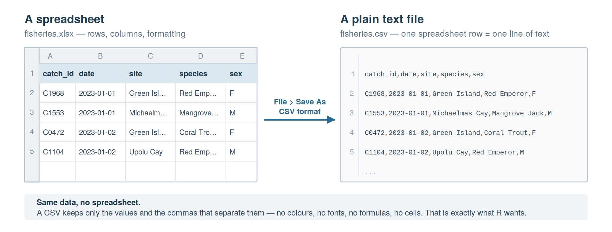
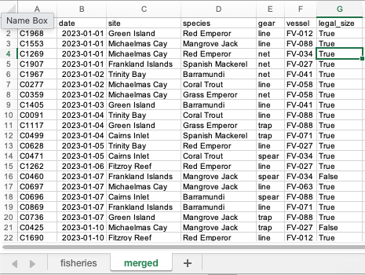
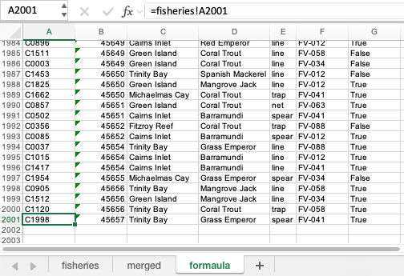
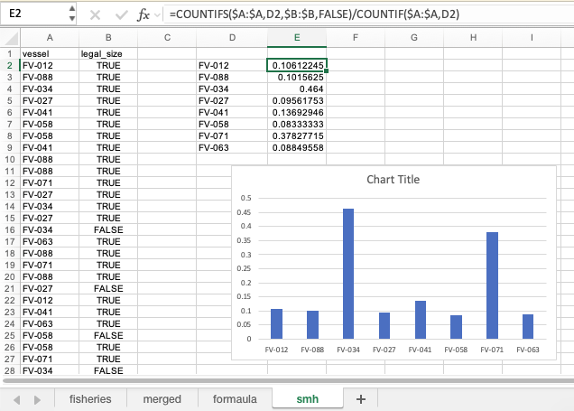

```{r setup, include=FALSE}
knitr::opts_chunk$set(echo = TRUE)
```

[&larr; Back to the SC1109 course page](../)

## Welcome to R ##
<!-- In lecture 1 we introduced you to R. R is a statistical programming language designed at its core to be flexible, scalable and extensible as well as completely free and open source. During this lecture we compared and contrasted R with MS Excel, pointing out advantages and disadvantages of the two options for reproducible and reliable data analysis. We also learnt about the different design philosophies between the two approaches and how the two can achieve very similar outputs by utilising completely different data structures. During this lecture we briefly introduced some basic commands for creating and manipulating data in R and today we are going to put that theory into practice. -->

In module 1 of SC1109, you were introduced to data analysis in Excel where you modelled fisheries data. During this and the next two tutorials we will use these same datasets for analysis in R. To begin with today though, we'll start off with some basic commands in R using one of the datasets built into base R (base R meaning R on its own without any extra libraries loaded).

## PRE-WORK - to be completed before arriving to the tutorial ##
In order for us to do anything in the tutorial, you will need to have both R and RStudio installed on your machine.

## Working with an in-built dataset ##
### Importing a dataset ###
We are going to use a dataset built into base R called `mtcars`. These data were extracted from the 1974 Motor Trend US magazine, and comprises fuel consumption and 10 aspects of automobile design and performance for 32 automobiles (1973–74 models). But don't take my word for it, open RStudio and have a look yourself.

```{r, results='hide'}
# First, import the dataset using the data() function and then use the help function '?'
# By the way, any text you see following a '#' symbol is termed a comment.
# Comments allow you to annotate code but nothing within them is executed.
data("mtcars")
?mtcars

```

In the bottom right pane, you should see that the `Help` tab has popped up with a description of this dataset. Under `Format` you'll notice that it mentions that it is a `dataframe` type object. We can confirm that using the `class` command.

```{r, results='hide'}
# Check out the class of the mtcars dataset
class(mtcars)

```

Let's have a quick look at the contents.

```{r, results='hide'}
# The head command simply prints the first six rows to the screen
head(mtcars)

# Or another way to do the same thing
mtcars[1:6, ]

# Or if you just wanted to see the first four rows and six columns
mtcars[1:4, 1:6]

```

As we learnt in the lecture, dataframes are made up of equal length vectors arranged as a table. We also learnt that all values within a vector must be the same data type. Let's have a look at the composition of `mtcars`.

```{r, results='hide'}
# Check out the structure of the mtcars dataset using the str() function
str(mtcars)

```

Here you can see that the dataframe is made up of 11 vectors, each defined by a column name using the `$` symbol, and all of which in this case are numerical vectors.

### R as a calculator ###
At its heart, R is just a big calculator. In the console you can run basic mathematical operations directly.

```{r, results='hide'}
# Some basic sums
2+5
2*5
2/5
2-5
2^5

# Let's store the value of a couple of these as variables and then do some calculations with them
x <- 2/5
y <- 2^5
z <- x^y
z

```

This is going to be handy here because for most Australians, miles per gallon (column 1 of mtcars) doesn't mean much. Let's have a go at converting these units into something more comprehensible.

```{r}
# To convert mpg to kpl, multiply by 0.425. Let's store these values in a new vector
kpl <- mtcars$mpg * 0.425      # fuel economy in km per litre

# Have a look at the new kpl values
print(kpl)

# Check the class
class(kpl)

```

This is what we call `vectorised arithmetic`, which just means arithmetic conducted over a series of numbers contained within a vector. Now that we have the converted values, we can add them to the dataframe as a new column.

```{r, results='hide'}
# Add the kpl values to the mtcars dataframe as a new column
mtcars$kpl <- kpl

# Have a quick look at the first six rows of mtcars using the head() function
head(mtcars)

# As the mpg column is now redundant, we can remove it by setting it to NULL
mtcars$mpg = NULL
head(mtcars)

```

## Working with our own defined datasets ##
### Creating vectors and performing some vectorised arithmetic ###
Let's create three vectors, one for height, one for weight and one for sex so that we can calculate BMI. This is also a good point to talk about data types.

```{r, results='hide'}
# Create name vector. As these are character strings, each name should be placed between quotation marks
name <-c("John", "Mary", "Steven", "Bob", "Max", "Steph", "Shane", "Sharon", "Anthony", "Molly")

# Create a weight vector. As these are integers, each needs the suffix L to tell R that it is not a floating point number
weight <- c(72L, 60L, 121L, 92L, 63L, 68L, 87L, 70L, 75L, 62L)     # mass in kg

# Create a height vector. As these have decimal places, they will be imported as floating point or "numeric"
height <- c(1.70, 1.56, 1.82, 1.9, 1.68, 1.72, 1.81, 1.75, 1.77, 1.69)   # height in m

# Create a sex vector. As this is categorical, we use as.factor() to define them
sex <- as.factor(c("M", "F", "M", "M", "M", "F", "M", "F", "M", "F"))

# Investigate the class of each vector
class(name)
class(weight)
class(height)
class(sex)

# Create dataframe from these four vectors
pop_stats <- data.frame(
  name = name,
  height = height,
  weight = weight,
  sex = sex
)

# Now let's calculate BMI and include this as a new column
pop_stats$BMI <- pop_stats$weight / pop_stats$height^2     # BMI in kg/m^2
print(pop_stats)

```

Just say that after creating our vector, we decided that it might be useful to include weight as a floating point number, we can convert this column using the ``as.numeric()`` function.

```{r, results='hide'}
# Convert the weight column in our dataframe from an integer type to a numeric type
pop_stats$weight <- as.numeric(pop_stats$weight)

class(pop_stats$weight)

```

Now let's calculate the mean and standard deviation of our calculated BMI using the formulas:
$$Mean = \bar{x} = \sum x_i/n$$
$$SD=\sqrt(\sum(x_i-\bar{x})^2/(n-1))$$
Where:\
$x_i$ = all the observations\
$n$ = the total number of observations\
$\bar{x}$ = the mean of all observations

Let's give it a go

```{r, results='hide'}
# First calculate the mean
mean_bmi <- sum(pop_stats$BMI)/length(pop_stats$BMI)
print(mean_bmi)

# Then the standard deviation
sd_bmi <- sqrt(sum((pop_stats$BMI - mean_bmi)^2)/(length(pop_stats$BMI)-1))
print(sd_bmi)

```

Great, but do you really need to type all that out every time you want to calculate a mean and standard deviation? No! For almost every simple formula you could think of, someone is likely to have already written a function for it. You've already used a bunch of functions in order to get to this point (``head()``, ``class()``, ``str()``, etc) and if it wasn't already clear, these are built in commands that abstract away a whole bunch of code so that you can call them up using one simple instruction. Luckily for us here, functions to calculate mean and standard deviation are also baked into base R.

```{r, results='hide'}
# Calculate the mean bmi
mean_bmi_func <- mean(pop_stats$BMI)

# Calculate the standard deviation of BMI
sd_bmi_func <- sd(pop_stats$BMI)

# Now check that our calculated numbers are equal to these
mean_bmi == mean_bmi_func
sd_bmi == sd_bmi_func

```

Are these values significantly different from the hypothesised mean of 22.5? We could calculate this manually using the formula:

$$t=\frac{\bar{x}-\mu_0}{s/\sqrt n}$$
But no need to bother when we have an in-built t-test function

```{r, results='hide'}
# Run a simple student's t test
t.test(pop_stats$BMI, mu = 22.5)

```

## Working with external datasets and comparing R to Excel ##
### Importing a csv ###
A common format people use to record data is the ``csv`` format. These ``Comma Separated Values`` files are arranged in rows and columns with values separated by commas. These can be generated manually but they are also a file format option that you can save spreadsheets as in programs such as Excel. A related file format is the ``tsv`` or ``Tab Separated Values`` format where instead of commas, values are separated by tabs.

Unfortunately base R doesn't include functions to import Excel spreadsheet data directly but fortunately, it is very easy to export Excel spreadsheets as .csv files.



Today we are going to work with a csv called ``fisheries.csv`` which can be found [here](https://acalcino.github.io/SC1102_2026/SC1109_Tutorial_1/fisheries.csv). When you download this file to your own machine, make sure you put it in a logical location where you'll keep all the files generated as part of this component of the course. As I'm on a Mac, I'll create a director at ``~/Documents/teaching/2026/TR3/SC1109/`` and put it in there. This might look like a very long directory structure but if you organise your computer this way, your future self will thank you as months or years from now, you'll understand exactly what this file is and from where it came. If you are on a Windows machine, maybe try something like ``C:\Users\YourUsername\Documents\teaching\2026\TR3\SC1109\``. You can create these directories by just using Finder on Mac or File Explorer on Windows. What I do not recommend is just putting the file in your downloads folder or Desktop and naming it something like ``file1.csv``.

If you'd prefer to use R to create these folders, try this but remember to modify the directory structure to suit your needs.

```{r eval=FALSE}
dir.create(
"~/Documents/teaching/2026/TR3/SC1109/",
recursive = TRUE
)

```

Once your directory structure is organised, download the file to the correct location. You can also find an excel version of this file [here](https://acalcino.github.io/SC1102_2026/SC1109_Tutorial_1/fisheries.xlsx) which you can download to the same folder you just created.

#### Peeking at a file without opening it ####

Before we hand the file to R, let's have a look at it. If you like, you can simply open the file by navigating to it in Finder or File Explorer and opening it with Notepad/TextEdit/Word or whatever program you prefer. Alternatively, you can view it the way the computer sees it as plain text. To do this, open RStudio and look at the window in the bottom left. There you'll find a `Terminal` tab sitting next to the `Console`, and this gives you access to a command line where you can use ``shell`` commands as opposed to ``R`` commands. The command to print the first few lines of a file depends on which operating system you are using and where you've saved your file.

**macOS or Linux** — use ``head``:

```{bash eval=FALSE}
head -n 5 ~/Documents/teaching/2026/TR3/SC1109/fisheries.csv

```

**Windows** — use PowerShell's ``Get-Content``:

```powershell
Get-Content C:\Users\YourUsername\Documents\teaching\TR3\SC1109\fisheries.csv -Head 5

```

This is pretty ugly in its raw form but once we import it into R, you'll see that it takes on the nice, clean format of a data frame type object. If you're interested in ``shell`` scripting then we encourage you to look into this yourself, but as far as this course is concerned, this is the last you'll see of it.

#### The portable way — do it in R ####
Every one of you has R, whatever machine you are sitting at, so R is the one place this is guaranteed to work and to work in the same way on every machine regardless of the operating system installed.

```{r}
# Import the dataset using the read.csv() function.
# A bare file name works when the file is in R's current working directory.
# If you saved it somewhere else, hand read.csv() the full path instead, e.g.
# read.csv("~/Documents/teaching/2026/TR3/SC1109/fisheries.csv")
fisheries <- read.csv("fisheries.csv")

# Have a look at the first five rows and six columns
fisheries[1:5, 1:6]

# Check out the class of each vector in the data frame
str(fisheries)

```

One thing you'll notice is that the ``$date`` column isn't recognised as a date type vector, rather as a character type. Change this using the ``as.Date()`` function. The ``$legal_size`` column is also included as a ``character`` type, not a TRUE/FALSE ``logical`` type. This also needs to be fixed.

```{r}
# Convert the date vector from character to date type
fisheries$date <- as.Date(fisheries$date)

# Convert $legal_size to logical
fisheries$legal_size <- as.logical(fisheries$legal_size)

# Check that the change worked
str(fisheries)

```

There are plenty of ways that data frames can be manipulated so let's try out a few.

```{r}
# First let's create a data frame from the fisheries data frame but just with the first four columns
fisheries_reduced <- fisheries[, 1:4]

# That comma is important. It indicates that you want all rows, but only columns one to four.
# Next let's create another data frame that includes $catch_id, $vessel, $legal_size and $gear
legal <- fisheries[, c("catch_id", "vessel", "legal_size", "gear")]

# Again, that comma indicates that we want all rows here.
# Another thing we can do is merge data frames as long as the two contributing data frames have at least one shared column. In our case, both sub data frames include the $catch_id column
merged_df <- merge(fisheries_reduced, legal, by = "catch_id")

```

Of course it would make more sense in this case to have just included the columns we wanted in the original subset but this was just meant as an exercise.

Try and do the same thing in Excel. Open either the ``.csv`` file or the ``.xlsx`` file and try to manipulate it to produce the same outcome as ``merged_df``. How would you go about doing this? Would you just delete the columns you aren't interested in? This would work but what if you later decided that you needed those data? Maybe you'd create a new spreadsheet or a new tab and copy and paste the data from the original into this. This would also work but it introduces the possibility of human error where you accidentally click or copy the wrong column. The other issue is that there is now no record in your new tab of where these data came from. Excel doesn't record your copy and paste procedure anywhere so a new person looking at your table for the first time will have no easy way to validate that the data in the new tab is a reliable manipulation of the original raw data as they cannot see how it was produced.



A third option is direct the cells in a new tab to read particular cells in the original tab using the ``=`` symbol. Try this out for yourself. Create a new tab, click in cell ``A1``, type ``=`` and then click across to cell ``A1`` in the original tab and press enter. This will populate your cell in your new tab with the correct data from the original tab. Now use this approach to fill in the whole table with the correct columns.



This is better than the copy paste method as anyone looking at your sheet will be able to see that the data in the new tab is directly referenced from the data in the original raw data tab. The problem is though that this person is very unlikely to check every single cell in the 2001x7 spreadsheet and so if a small type was introduced into the formula in a particular cell at some point, this is very unlikely to be picked up. It was also a laborious process creating this spreadsheet that involved many mouse clicks as opposed to the three lines of code used in the R approach. This issue will also worsen if the table was to grow. Imagine a situation where the original table was a 2001x1000 spreadsheet and you needed to pull out 50 randomly placed columns to create your new tab. In R, this would still be a three line command where the only the number of column names in step two would expand but to do this in excel would be a multi-mouse click nightmare.

Now what we want to find out is whether any particular vessel is responsible for an outsized number of illegal sized catches. The first way to do this in R is to extract the relevant information and display it as a table.

```{r}
# Create a table of legal and illegally sized catches per vessel
legal_table <- table(fisheries$vessel, fisheries$legal_size)

print(legal_table)

# Check the class() of your table while you're at it
class(legal_table)

```

Immediately there are two vessels that stand out, but it would be good to have a more visual method of observing these differences.

```{r}
# Create new table from the original table with proportions rather than raw numbers to account for differing numbers of catches using prop.table()
prop_tab <- prop.table(legal_table, 1)

# The , 1 ensures that each row equals 1 rather than the sum of all values across the table

# Create a bar chart of just the undersized catches
barplot((prop_tab)[, "FALSE"])

# We can modify this plot to include titles and you can increase the y axis limit to 0.5
barplot((prop_tab)[, "FALSE"],
        ylab = "Proportion of undersized catches",
        xlab = "Vessel ID",
        ylim = c(0, 0.5))

# To see all barplot() options
?barplot

```
For a bit of fun, have a go at trying to produce an equivalent plot in Excel without throwing your computer across the room and storming out in anger. First you need to create a new tab with the correct columns, in a new cell copy the ``Vessel ID`` again and then use the ``Data/Remove Duplicates`` tool to create a unique list, then use find and replace to change all the ``True`` and ``False`` entries into ``TRUE`` and ``FALSE``, then use ``=COUNTIFS($A:$A,D2,$B:$B,FALSE)/COUNTIF($A:$A,D2)`` to calculate the proportion of illegal catches per vessel, then plot the whole thing using the barchart tool. Basically, it's a whole lot of clicking and not a whole lot of fun.



And after all this, you have a messy spreadsheet with data and plots located in the one place compared with the R approach where you have a few clean lines of reproducible code and a plot you can export in your favourite image format.

## Packages ##

So far, everything we have done in R has been using base R, which is R without any extra bells and whistles attached. You can achieve a lot in base R, but there are certain things that become difficult or cumbersome to do on your own. This is where ``packages`` help out. Packages are a collection of functions developed by a third party to extend the capabilities of base R. You can think of them like an expansion packs for your favourite game. Anyone can develop a package and most are done so independently of R, RStudio or Posit (the company behind RStudio), however this is a lot of cross pollination across the ecosystem so the same names often pop up in different repos.

You might have noticed that the R plot we just created isn't exactly beautiful. There are lots of ways to improve this using base R, but an even better way is to load a dedicated plotting package, the most famous of which if [ggplot2](https://ggplot2.tidyverse.org/). Let's install ggplot2, load it and then use it to recreate the plot.

```{r eval=FALSE}
# First, check if ggplot2 is installed already or not
is_ggplot2_installed <- "ggplot2" %in% installed.packages()[,"Package"]

if (is_ggplot2_installed) {
  print("yep")
} else {
    print ("nope")
}

# If it's not installed (ie. the previous command prints "nope", rather than "yep"), install it
install.packages("ggplot2")

```

Once that's done, no need to repeat it as you only ever need to install a package once. In future sessions you'll only have to load it with `library()` each time you want to use it.

```{r}

# Load up the package
library(ggplot2)

# Now lets try recreate the plot. First, ggplot requires a dataframe, not a table
prop_tab_df <- as.data.frame(prop_tab)

# And now the plot script. So instead of using base R's barplot function, we'll call ggplot with geom_col() to tell it to create a bar plot
ggplot(subset(prop_tab_df, Var2 == "FALSE"),
       aes(x = Var1, y = Freq)) +
  geom_col(fill = "steelblue", width = 0.7) +
  scale_y_continuous(limits = c(0, 0.5), expand = c(0, 0)) +
  labs(x = "Vessel ID",
       y = "Proportion of undersized catches",
       title = "Undersized catches by vessel")

```

That last command was a lot, so let's break it down. At a minimum, ggplot needs three things - input data, and aesthetic mapping ``aes()`` to explain which column goes on which axis, and a ``geom()`` to explain what sort of plot to create. On line 1, we told ggplot to look at our prop_tab_df dataframe and to subset it so that only lines where the ``Var2`` column equals ``FALSE`` are included. Another way this could have been done would be to create a new dataframe by subsetting ``prop_tab_df`` before plotting, and then plotting that without the ``subset()`` command.

The second line is pretty self explanatory, Var1 on the x axis, Freq on the y. The third line explains that we want a bar chart by calling ``geom_col()``. It then specifies the colour we want for the fill and the width of the bars.

Those three lines are actually all that is needed to produce a minimal plot. Just run those and compare them to the full command. Also have a play around with changing colours and widths to see how the plot responds. Have a go at dropping line two or three to see what happens.

Without line four, you'll notice that the top mark on the y axis is 0.4. ``scale_y_continuous()`` allows us to override this default and to specify a maximum and minum value for the y axis using ``limits``. Additionally, ``expand`` allows us to control the padding beyond the limits of your axes. We use it here to put the bars right down at the bottom of the plot, rather than just above it.

Packages like ``ggplot2`` extend the capabilities of base R to include all sorts of extra functionality that would be cumbersome and laborious for you to generate without them. ``ggplot2`` is a great example of this as it allows endless flexibility and customisability to your plots that would not be possible without it. Once you get deeper into it, you'll see that it allows you to modify plots beyond what is possible in Excel in order to display your important data in exactly the way you would like to do so.

## Before you go ##

You have made a figure from some dummy fisheries data in your first week of R. Next week we stop typing into the console and start writing **scripts** — files you can save, re-run, and hand to someone else so they get exactly the same answer you did.

---

*SC1109 R Bootcamp, James Cook University. [Course home](../)*
