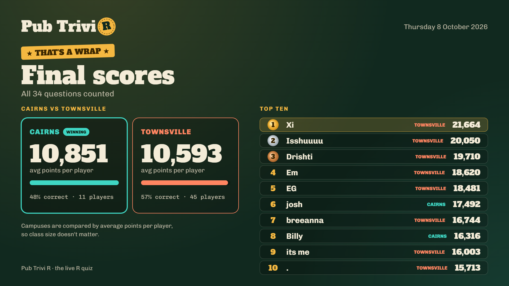

# Tutorial materials for SC1102 and SC1109

Welcome to the SC1102/SC1109 R Bootcamp. Here you will find all the materials required for the tutorial component of this section of the course.

You have just spent three weeks modelling population growth and fisheries data in Excel. Over the next three weeks you will learn to the same sorts of analyses in **R**. The goal is not to make you a programmer. It is to make you comfortable enough in R that when you reach the El Niño modelling section, you can spend your effort on the science rather than on the software.

Each week has three parts: a **one hour lecture**, a **two hour practical** (the tutorials below), and a **one hour synthesis session**.

## Before you start

You will need **R** and **RStudio** installed on your own machine before commencing Module 4. Detailed instructions for how to install R and RStudio can be found on the course website under Module 4.

## Pub TriviR update
Congratulations to everyone who participated in the inaugural Pub TriviR contest during the synthesis session today! Very sorry for having run slightly over the allocated time which meant we lost connection with Townsville but fortunately it was pretty much done by that point.

Huge congratulations to the top three players who, for better or worse, were all from Townsville this week, and just a note on the discrepancy we saw where Townsville won most rounds but Cairns won overall - turns out that each round the scores were divided by the number of players who actually answered at least one question that round while the overall winner was calculated by dividing by all registered players. So despite Townsville getting higher scores on average for those playing, their high dropout rate hampered them overall.

Keen to see how things go in Round 2 next week.

## Course Outline - SC1102

Module 4: [Welcome to R](SC1102_Tutorial_1/week_1.html)

<!-- Week 2: [Writing scripts and reproducibility](SC1102_Tutorial_2/week_2.html)

Week 3: [Building your own RMarkdown document](SC1102_Tutorial_3/week_3.html) --->

## Course Outline - SC1109

Module 4: [Welcome to R](SC1109_Tutorial_1/week_1.html)

<!-- Week 2: [Writing scripts and reproducibility](SC1109_Tutorial_2/week_2.html)

Week 3: [Building your own RMarkdown document](SC1109_Tutorial_3/week_3.html) --->

## Data sets

Module 4

- [fisheries.csv](SC1102_Tutorial_1/fisheries.csv) — 2000 synthetic catch records
- [fisheries.xlsx](SC1102_Tutorial_1/fisheries.xlsx) — the same data as an Excel workbook

<!-- Week 2

- [Paramecium_aurelia.csv](SC1102_Tutorial_2/Paramecium_aurelia.csv) - Paramecium population growth data
 --->
 
## Where this is going

By the end of Week 6 you will have written a short, complete report in RMarkdown, including text, code, tables and figures in a single document that anyone can re-run and get exactly your result.
